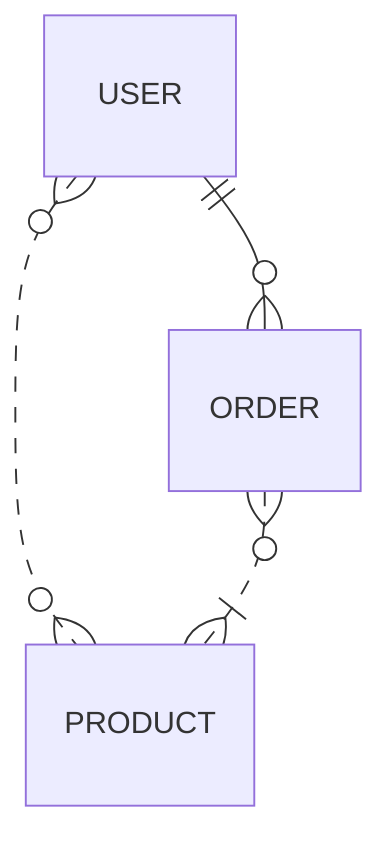
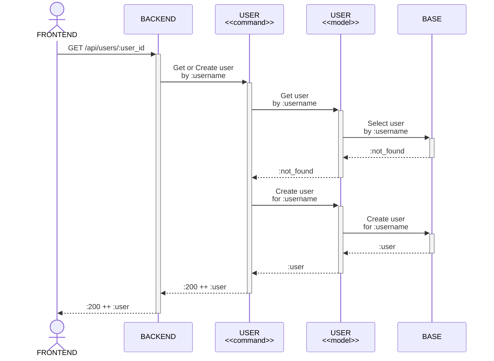
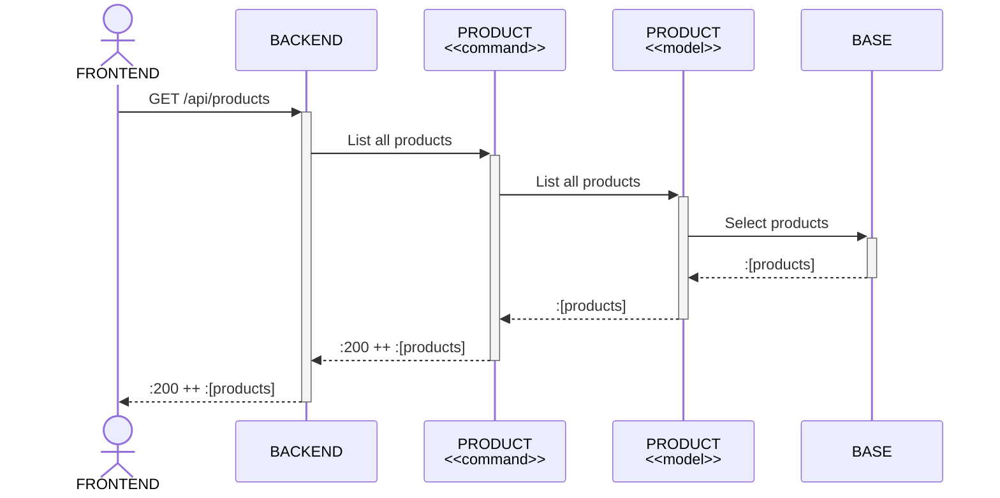
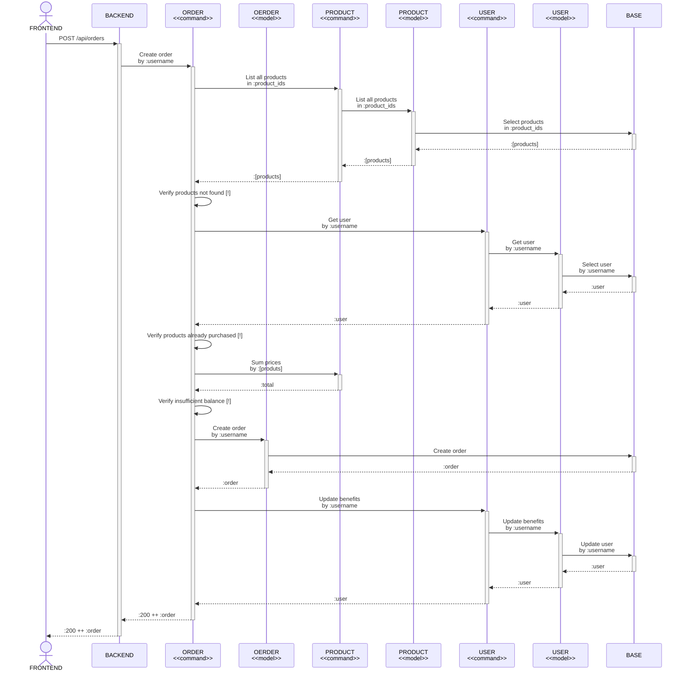

# Backend

[](https://github.com/raulpe7eira/backend-exercise/actions/workflows/elixir-ci.yml)

> A small project to test my skills.


## :warning: You need install before to run locally

~> [git](https://git-scm.com) ++
[asdf](https://asdf-vm.com) ++
[Docker](https://docker.com)

## :writing_hand: How to use and run locally?

```bash
# Clone this repository
git clone git@github.com:raulpe7eira/backend-exercise.git

# Setup working directory
cd backend

# Install erlang and elixir
asdf install

# Install dependencies
mix deps.get

# Start database
docker-compose up -d

# Setup database
mix ecto.setup

# Run check lint
mix credo --strict

# Run check format
mix format --check-formatted

# Run check security
mix sobelow --config

# Run check quality
mix coveralls.html

# Start server or inside IEx with `iex -S mix phx.server`
mix phx.server
```

After these commands, you can access the following features at [`localhost:4000`](http://localhost:4000). The API documentation is avaliable at home path `/docs`. I wrote with [API Blueprint](https://apiblueprint.org), I used [apiary](https://apiary.io) editor and generated the static `html` with [aglio](https://github.com/danielgtaylor/aglio).

## :dart: My decisions

1. I planning my deliver with [Github Project](https://github.com/raulpe7eira/backend-exercise/projects/1), and I lock some minute to doodles some pre-solutions, like the ones listed in [doodles section](#doodles).

1. My code structure has folders to put commands by entities, I don't kwon, if it's a good aprouch... :sweat_smile:.

1. Finally, the project was a very good exercise for me, thanks for the opportunite :pray:.

### :art: Doodles

> Entity relationship diagram



> Sequence diagram to `GET /api/users/:user_id`



> Sequence diagram to `GET /api/products`



> Sequence diagram to `GET /api/products`


